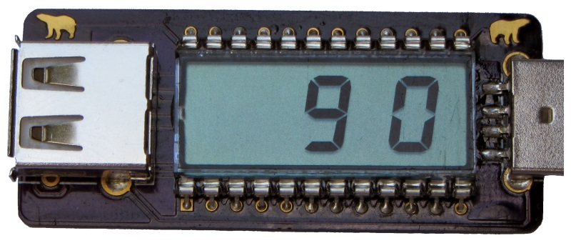

### UsbAmps (revision C) ###

UsbAmps is a small USB pass-through device that measures current, voltage and
power used by whatever is connected on its output.

By default it shows current value but you can also recall minimum and maximum.

#### Usage ####

Two bears are actually touch-sensitive buttons. Outside button determines what
are you measuring (current, voltage, or power) and inner button determines
whether you will see current value or minimum/maximum.

|               |                |                                       |
|:-------------:|:--------------:|---------------------------------------|
| *Short press* | Outside button | Current (A) / Voltage (V) / Power (W) |
|               | Inside button  | Actual / Maximum / Minimum            |
| *Long press*  | Outside button | Resets minimum/maximum stats.         |

##### High-power charging #####

Special "High power" mode can be accessed if you hold inside button during
power-on of UsbAmps. On screen you will see HIP, plugged device will believe
this is Dedicated Charger Port and it will no longer be recognized by Windows.
This will allow it to pull up to 1.5 A but at a cost of data connectivity. Most
newer notebooks I have tried this on gave above 1 A charging current without
problem.

#### Specifications ####

|         | Input ratings            |
|---------|--------------------------|
| Voltage | 5 ±10% V                 |
| Current | 10 mA (typical)          |
|         | 30 mA (with backlight)   |

|         | Output ratings           |
|---------|--------------------------|
| Current | 2 A (maximum)            |

##### ADC resolution #####

10-bit ADC enables 1024 distinct measurement steps. Since 2.048 V is used as
voltage reference this brings us to resolution of 2 mA for current measurement.
Voltage has an additional divider and thus has resolution of 6.4 mV.

Since device averages multiple measurements you can also expect values
in-between.

##### Display resolution #####

Display will show resolution of 1 mA up to 100 mA. All other measurements are
shown with resolution of 10 mA/mV/mW (e.g. 5.10 V).

##### Accuracy #####

Accuracy is given as ±(percent of reading + [counts](http://www.youtube.com/watch?v=U4JFeU-o2kc)
of least significant digit).

Due to averaging, it will usually do better than this, but don't count on it as
a precision device.

###### DC current ######

| Range          | Resolution | Accuracy |
|:--------------:|:----------:|:--------:|
| 0 - 99 mA      | 1 mA       | 1% + 6   |
| 0.10 - 2.00 A  | 0.01 A     | 1% + 4   |

###### DC voltage ######

| Range          | Resolution | Accuracy |
|:--------------:|:----------:|:--------:|
| 5.00 ±10% V    | 0.01 V     | 1% + 2   |

#### FAQ ####

##### Why is Rout for current measurement 1kO? #####

Since sense resistor is 100mO, having 1kO gives us nice 1V/1A. Maximum current
that we actually have to measure is 1.5 A (USB battery specification). Having
2.048 V as a voltage reference means that current measurements are restricted
to 2A which gives us some headroom. Yes, measurements in mA range are quite
imprecise but when was last time you saw USB device that pulls only 10 mA?

##### Why is 554 mA shown as 0.55 A? #####

Since device is intended for measuring up to 1.5 A (USB battery specification)
and decimal point is rather small, there is a chance that you can mistake
1.23 A for 123 mA when looking from a far. If your vision is better than mine
or you don't deal much with higher currents, you can download source and change
`OPTION_THREE_DIGIT_MILLIAMPS` define in `option.h` to `true`.

Notice that this means your accuracy is 1% + 6 in that range (same as for
0 - 99 mA range).

##### Device shows some mA value even when not plugged in. #####

You can calibrate device to show 0 when there is no current passing through.

While plugging device in hold both buttons together until you see CAL on
display. This will perform the 0-point calibration. Nothing else should be
connected to UsbAmps at this time.

##### Where has Charging Downstream Port dissapeared? #####

If you hold outside button during power-on of UsbAmps some older firmware
versions would show HIP  that would disappear quickly. This used to trick a
(supported) device into using Charging Downstream Port. Advantage is that you
would get 1.5 A charging along with data. It might not work for all devices (or
computers) but I had a quite good experience with support for it.

However, it also proved to be finicky to actually work with it. Not only that
it required you to have device already plugged in but it was extremelly easy to
trigger by accident. It is almost impossible to plug the device in without
touching the outer key and thus this functionality was usually triggered by
accident and not all devices would handle it gracefully.

If you prefer old behavior you can change it in `option.h` by setting
`OPTION_DSHORT_CDP_ENABLED` to `true`.

##### What about backlight? #####

If you fit optional resistors and two right-angle LEDs, you will get a crude
backlight. To turn it on just long-press inner button. However do notice that
this backlight is bad at best. I definitely don't count on it being a feature.
For all practical purposes there is no backlight for UsbAmps. I am looking at
small and cheap LDC display with backlight. If anyone knows one, do let me
know.

To improve backlight a bit it is possible to laser cut the diffuser. Clear
plastic works the best. Beware to export design in EPS format because some
laser cut services will have issue with SVG.

#### Schematics ####

#### Manufacturing ####

If you want to make this board your self, just grab the latest release (notice
that there is a left-hand and a right-hand version) and send gerbers over to
[OSH Park](http://oshpark.com/) (or any other PCB manufacturer of your choice).

Inside the archive you will also find parts list and latest firmware.

##### Programming Firmware #####

To get firmware on, you will need [PICkit 3](http://www.microchip.com/stellent/idcplg?IdcService=SS_GET_PAGE&nodeId=1406&dDocName=en538340&redirects=pickit3).
In addition I prefer using [pogo pins](http://www.jmedved.com/2012/04/pogo-pickit/)
instead of header soldering. That way you can just press PICkit 3 to the board,
wait a few seconds and work is done.

---

*Josip Medved, [www.jmedved.com](http://www.jmedved.com/)*
